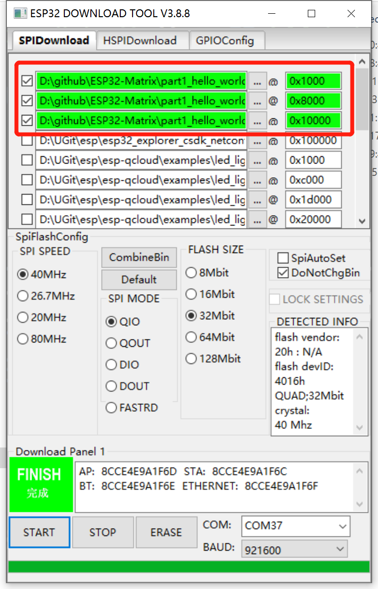
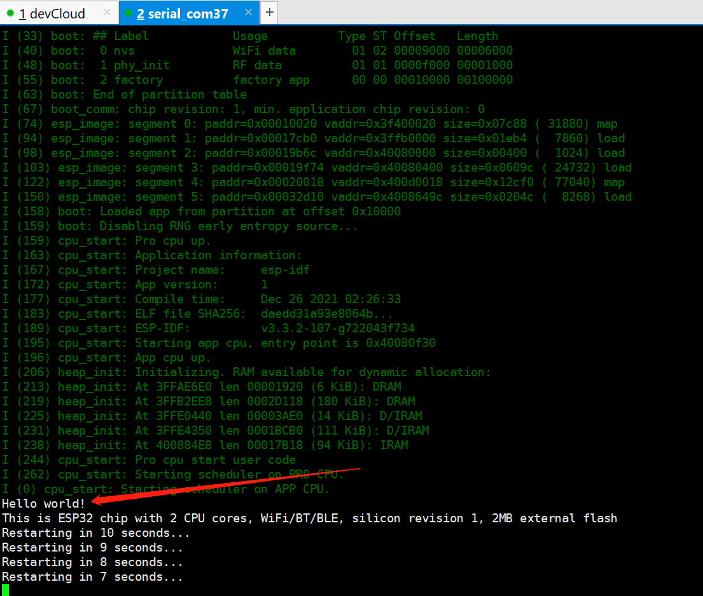

# Hello World Example

>  运行该示例是为了验证编译工具链是否配置正常，烧录是否正常。

## 快速开始

如果你和我一样使用了WSL2开发，那么就一起开始吧（其他Linux发行版过程基本类似）。

1. 切换为root用户，在wsl2中的docker操作有些是需要权限的，切换为root用户一劳永逸。

```shell
$ su root
```

2. 启动docker，wsl2的终端docker默认是关闭的，我们必须要手动开启docker服务

```shell
# service docker start
```

3. 获取esp-adf的docker编译镜像,使用docker编译可以简化我们编译环境配置的步骤，非常方便。这一步只需要执行一次，如果已经有了则直接跳过。

```shell
# docker pull hubertxxu/esp32_adf_build
```

4. 启动docker

```shell
 # pwd
/mnt/d/github/ESP32-Matrix/part1_hello_world
# -v 是使用的docker容器卷技术
# docker run -it -v /mnt/d/github/ESP32-Matrix/part1_hello_world:/home/ESP32-Matirx/part1_hello_world hubertxxu/esp32_adf_build /bin/bash
```

5. 配置docker容器

```shell
# 这样表示成功进入docker容器内部
root@d55d555e699b:/usr/home# ls
README.md  esp-adf
# 运行. ./export.sh
root@d55d555e699b:/usr/home# cd esp-adf/
root@d55d555e699b:/usr/home/esp-adf# cd esp-idf/ 
root@d55d555e699b:/usr/home/esp-adf/esp-idf# . ./export.sh
```

6. 找到我们的工程，编译

```shell
root@d55d555e699b:/home/ESP32-Matirx/part1_hello_world# idf.py build
# 编译完成后，可以看到如下信息
Scanning dependencies of target ldgen_esp32.project.ld_script
[100%] Generating esp32.project.ld
[100%] Built target ldgen_esp32.project.ld_script
Scanning dependencies of target ldgen
[100%] Built target ldgen
Scanning dependencies of target hello-world.elf
[100%] Building C object CMakeFiles/hello-world.elf.dir/dummy_main_src.c.obj
[100%] Linking CXX executable hello-world.elf
[100%] Built target hello-world.elf
Scanning dependencies of target app
[100%] Generating hello-world.bin
esptool.py v2.8
[100%] Built target app

Project build complete. To flash, run this command:
../../../usr/home/esp-adf/esp-idf/components/esptool_py/esptool/esptool.py -p (PORT) -b 460800 --after hard_reset write_flash --flash_mode dio --flash_size detect --flash_freq 40m 0x1000 build/bootloader/bootloader.bin 0x8000 build/partition_table/partition-table.bin 0x10000 build/hello-world.bin
or run 'idf.py -p (PORT) flash'
```

7. 烧录



8. 运行，按下开发板复位按键，打开串口助手，如果看到如下log信息，表明本实验成功运行



## 总结

这个工程意在让大家快速搭建一个开发、调试环境。因为ESP-ADF中使用的ESP-IDF并不是最新的稳定版本，所以如果用你电脑已有的ESP-IDF编译，肯定会出现很多意想不到的错误。

所以，这里引入了docker做为统一的编译环境，我们的开发环境还是windows。
